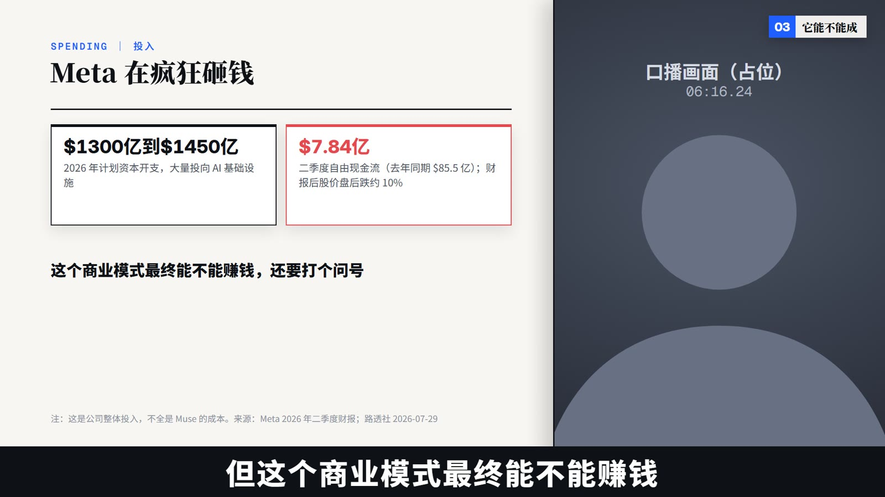

# 第32期动效代码：数据新闻风（Remotion）

这期视频画面用的就是这套代码：左边是版面、右边是人物，画面上的每个元素都在口播念到它的那一刻出现。整期 7 分半、52 个页面的分镜原样保留，可以直接当模板改成你自己的视频。



## 快速开始
需要 Node.js 18.12 或更新版本。
```bash
npm install
npm run studio     # 打开 Remotion Studio, 在浏览器里逐帧预览
npm run render     # 渲染整片到 out/ep32.mp4 (1920×1080, 50 帧)
```
第一次运行时 Remotion 会自动下载一个浏览器用于渲染。如果下载不下来（比如网络受限），可以改用本机的 Chrome：
```bash
# Windows PowerShell
$env:REMOTION_BROWSER_EXECUTABLE = "C:\Program Files\Google\Chrome\Application\chrome.exe"
# macOS
export REMOTION_BROWSER_EXECUTABLE="/Applications/Google Chrome.app/Contents/MacOS/Google Chrome"
# Linux (按你的安装位置)
export REMOTION_BROWSER_EXECUTABLE="/usr/bin/google-chrome"
```
`npm install` 时如果看到 esbuild 的 install-scripts 提示，可以忽略，不影响预览和渲染。

## 示例里为什么全是占位块
示例分镜来自一期已经发布的视频。原片里用到的口播者出镜画面和声音、产品官方演示视频与截图、各家 App 图标和品牌图形，版权、商标或肖像权都不属于这个仓库，所以都换成了占位：斜纹方块、首字母图标 / 徽章、带时间码的人形剪影。**版面、动画、时间轴、音效都是原样的**，示例没有人声，只有音效。

## 做一期自己的视频
1. **字幕**：`npm run lines -- 你的字幕.srt`（等同 `node tools/srt2lines.mjs 你的字幕.srt`），生成 `src/episode/lines.ts`。先把字幕里的错字改对。
2. **片长和跳剪点**：改 `src/episode/time.ts` 的 `DURATION`（秒数 × 50）和 `CUTS`（没有就写 `[]`）。
3. **素材**：出镜底片、人声、图片放进 `public/media/`，在 `src/episode/assets.tsx` 填路径。底片要求横屏、与全片等长、人物居中。
4. **分镜**：照着 `src/episode/pages1-3.tsx` 写自己的页面，在 `src/episode/index.ts` 里配章节。注意示例里每页的起止帧是按原片口播调好的具体数字，换了字幕要重新定。写法和规矩见 [AI_GUIDE.md](AI_GUIDE.md)，让 AI 帮你写时，把这份文档一起交给它。
5. **检查**：`npm run still -- Ep32 out/check 帧号,帧号,…`（等同 `node tools/stills.mjs …`）渲几张静帧看图，或者直接在 Studio 里拖着看。
6. **出片**：`npm run render`；要 2560×1440 就加参数：`npm run render -- --scale=1.3333333333333333`。

## 目录
- `src/engine/`：引擎（时间轴、总装、组件库、素材、动画、字体），和内容无关。
- `src/episode/`：示例这一期的内容。
- `public/fonts/`：字体及其许可证；`public/sfx/`：音效（全部由 `tools/sfx_synth.py` 程序合成，可以重新生成）。
- `tools/`：`srt2lines.mjs` 字幕转换、`stills.mjs` 批量静帧、`sfx_synth.py` 音效合成（需要 Python 3 + numpy + scipy）。
- 中文字体裁剪到了 GB2312 常用字和常用符号，生僻字和少数符号（例如短横线「–」）会缺字，需要时换成完整版字体（见 AI_GUIDE）。

## 许可
本目录下我们写的代码和合成音效按 MIT 许可发布（见仓库根目录的 [LICENSE-CODE](../../LICENSE-CODE)）。
字体等第三方组件各有自己的许可，见仓库根目录的 [NOTICE.md](../../NOTICE.md) 和 `public/fonts/LICENSES/`。
**Remotion 本身不是 MIT**：个人、非营利组织和不超过 3 人的公司可以免费使用，更大的公司需要购买 Remotion 的公司许可。是否需要购买请以 [Remotion 许可](https://www.remotion.dev/license) 为准。
